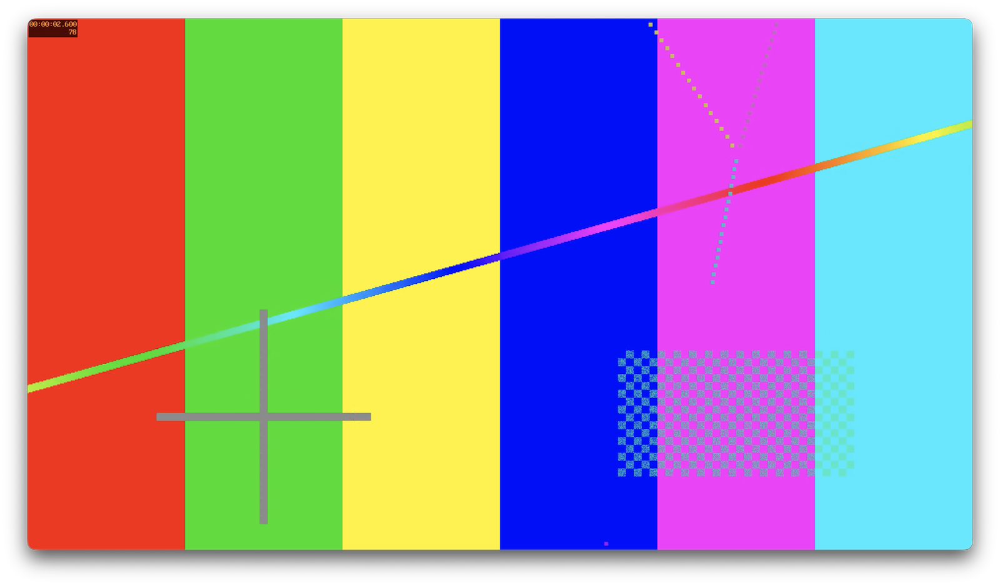

# mp4-fixtures



A configurable test fixture generator for MP4 files, built to support [Video Commander](https://video-commander.com) testing.

Generates a comprehensive library of MP4 (or MOV/MKV) test files covering codecs, resolutions, frame rates, audio variants, container formats, metadata, and edge cases — all driven by a single `fixtures.toml` config.

## Requirements

- `ffmpeg` on your PATH (or set `ffmpeg_bin` in `fixtures.toml`)
  - Recommended: build from [ffmpeg-builder](https://github.com/video-commander/ffmpeg-builder) for a static binary with all codecs
- Python 3.8+ (3.11+ preferred for stdlib `tomllib`; older versions need `pip install tomli`)

## Quick start

```bash
git clone https://github.com/video-commander/mp4-fixtures
cd mp4-fixtures
chmod +x generate.sh
./generate.sh
```

Output goes to `./output/` by default.

## Releases

Tagging `fixtures-v*` runs `.github/workflows/release.yml`, which generates the full set on CI and publishes it as a release asset (`mp4-fixtures-<tag>.tar.zst`). Downstream test suites can download a pinned tag so their inputs stay byte-identical until the pin is bumped deliberately:

```bash
git tag fixtures-v1 && git push origin fixtures-v1
```

Note: `aac_he` requires an ffmpeg with `libfdk_aac` and is skipped on stock builds, including CI releases.

## Configuration

All configuration lives in `fixtures.toml`. The key sections:

### `[settings]`

```toml
[settings]
ffmpeg_bin    = "ffmpeg"   # path or binary name
output_dir    = "./output"
output_format = "mp4"      # mp4 | mov | mkv
```

### `[categories]`

Enable or disable entire fixture categories:

```toml
[categories]
codecs      = true
resolutions = true
frame_rates = true
audio       = true
container   = true
metadata    = true
edge_cases  = true
hdr         = false   # disabled by default — slow and large
```

### `[defaults]`

Fallback values used by all fixtures unless overridden:

```toml
[defaults]
crf           = 23
audio_bitrate = "128k"
duration      = 10
resolution    = "1920x1080"
fps           = 30
```

### `[fixtures.<category>.<name>]`

Override specific parameters per fixture, or disable individual fixtures:

```toml
[fixtures.codecs.hevc_main]
enabled = true
crf     = 28

[fixtures.edge_cases.long_2hr]
enabled       = true
duration      = 7200
crf           = 40
audio_bitrate = "32k"
```

### `[[custom]]`

Add arbitrary fixtures without editing any script. `video_args` and `audio_args` are passed verbatim to FFmpeg:

```toml
[[custom]]
name       = "prores_422"
enabled    = true
video_args = "-c:v prores_ks -profile:v 2"
audio_args = "-c:a pcm_s16le"
duration   = 10

[[custom]]
name       = "low_bitrate_360p"
enabled    = true
video_args = "-c:v libx264 -crf 35 -vf scale=640:360"
audio_args = "-c:a aac -b:a 48k"
duration   = 30
```

## Using a different config file

```bash
./generate.sh --config path/to/my-config.toml
```

## Output format notes

`output_format` swaps the container extension globally (`mp4`, `mov`, or `mkv`). Codec compatibility is your responsibility — not all codecs mux into all containers. For example, `mov_text` subtitles require MP4/MOV; use `srt` for MKV.

## Fixture categories

| Category | What it generates |
|---|---|
| `codecs` | H.264 (baseline/main/high), HEVC, AV1, VP9 |
| `resolutions` | 360p, 480p, 720p, 1080p, 4K |
| `frame_rates` | 23.976, 24, 25, 29.97, 30, 50, 59.94, 60, VFR |
| `audio` | AAC-LC, AAC-HE, Opus, AC-3, 5.1, multi-track, audio-only, video-only |
| `container` | Fragmented fMP4, faststart, moov-at-end, edit list (elst) |
| `metadata` | Rotation (90/180/270), chapters, embedded subtitle track |
| `edge_cases` | Very short, 2-hour, truncated, B-frames, many fragments |
| `gaps` | Timeline gaps: dropped video frames (stretched samples), tracks ending early |
| `hdr` | HEVC HDR10 with correct SEI metadata |

## Adding a new category

1. Create `lib/mycat.sh` (source `lib/helpers.sh` functions — `ff`, `fixture_enabled`, `fixture_get`)
2. Add `mycat = true` under `[categories]` in `fixtures.toml`
3. Add `[fixtures.mycat.*]` entries as needed
4. `generate.sh` picks it up automatically via `run_category mycat`

## Log

Each run writes a full log to `$output_dir/generate.log`. Check it for skipped fixtures (codec not available) vs actual failures.
